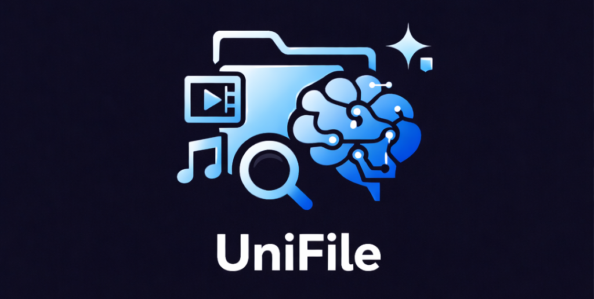
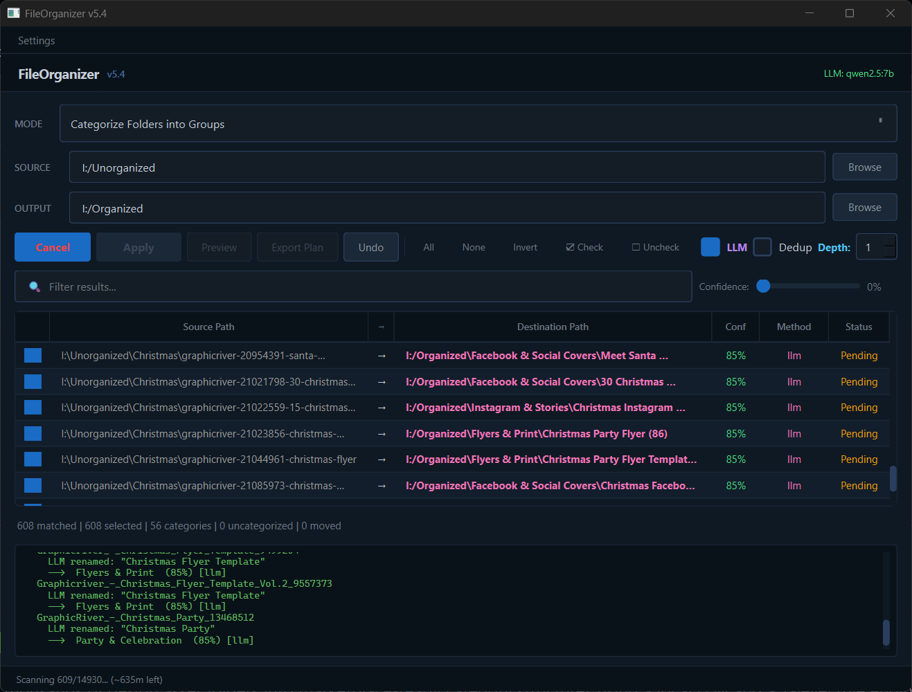

<!-- codex-branding:start -->
<p align="center"></p>

<p align="center">
  
  
  
</p>
<!-- codex-branding:end -->

# UniFile


> Unified AI-powered file organization platform — combining tag-based library management, 7-level classification, LLM intelligence, cleanup tools, duplicate detection, and media metadata into a single premium dark-themed desktop app.



## Overview

UniFile merges the best ideas from five file organization projects into one cohesive tool:

| Source Project | Stars | What UniFile Takes From It |
|----------------|-------|----------------------------|
| [TagStudio](https://github.com/TagStudioDev/TagStudio) | 42k | Tag-based file library with hierarchical tags, aliases, color coding, field system |
| [FileOrganizer](https://github.com/SysAdminDoc/FileOrganizer) | — | Foundation: 7-level classification, Ollama LLM, PyQt6 GUI, 384+ categories |
| [Local-File-Organizer](https://github.com/QiuYannworworworworworworworwor/Local-File-Organizer) | 3.1k | AI file analysis with vision models (planned: Nexa SDK backend) |
| [classifier](https://github.com/bhrigu123/classifier) | 1.1k | Rule-based file sorting by extension (planned: category preset merge) |
| [mnamer](https://github.com/jkwill87/mnamer) | 1k | Media file renaming via TMDb/TVDb APIs (planned: media lookup panel) |

## Quick Start

```bash
git clone https://github.com/SysAdminDoc/UniFile.git
cd UniFile
python run.py  # Auto-installs all dependencies + Ollama on first run
```

On first launch, UniFile will:
1. Install PyQt6, SQLAlchemy, and other dependencies if missing
2. Download and install [Ollama](https://ollama.com) if not found
3. Start the Ollama server and pull the `qwen2.5:7b` model
4. Open the GUI with LLM mode enabled and ready

No manual setup required.

## Features

### Tag Library (NEW in v8.0)

Full tag-based file management adapted from TagStudio's SQLAlchemy models:

| Feature | Description |
|---------|-------------|
| Hierarchical Tags | Parent-child tag relationships with unlimited nesting |
| Tag Aliases | Multiple names for the same tag |
| Color-Coded Tags | 20 color presets for visual organization |
| Category Tags | Distinguish organizational categories from descriptive tags |
| Quick Presets | One-click Favorite, Important, Review, Archive tags |
| Entry Fields | 21 built-in field types (title, author, AI summary, TMDb ID, etc.) |
| Auto-Tagging | Classification results automatically create and apply tags |
| Bulk Operations | Scan directories, bulk-add files, batch tag assignment |
| Tag Search | Real-time search across tags and entries |

The tag library stores data in `.unifile/unifile_tags.sqlite` within your library directory — non-destructive, no files are modified.

### Media Lookup (NEW in v8.0)

Movie and TV metadata lookup powered by TMDb, OMDb, and TVMaze APIs (adapted from mnamer):

| Feature | Description |
|---------|-------------|
| TMDb Search | Search movies by title/year with poster art and full details |
| TVMaze Search | Search TV shows, browse full episode lists by season |
| OMDb Fallback | Secondary movie lookup via IMDb IDs |
| guessit Parser | Parse media filenames to auto-detect title, year, season, episode |
| Poster Preview | Full poster art display with synopsis, genres, and external IDs |
| Apply to Tags | Push metadata (title, synopsis, genres, IMDb/TMDb IDs) to Tag Library entries |
| Copy Metadata | One-click copy of all metadata fields to clipboard |
| Cached Requests | API responses cached for 6 days to reduce API calls |

### Nexa SDK Backend (NEW in v8.0)

Alternative local AI backend using Nexa SDK (adapted from Local-File-Organizer):

| Feature | Description |
|---------|-------------|
| LLaVA Vision | Image understanding and description via LLaVA v1.6 |
| Llama 3.2 Text | Text summarization and classification via Llama 3.2 3B |
| One-Click Switch | Toggle between Ollama and Nexa in Settings |
| Image Classification | Vision model describes images, text model classifies |
| File Content Analysis | Reads text files and generates summaries for classification |
| Model Catalog | 5 pre-configured model options for vision and text |

Enable in **Settings > Ollama LLM > Alternative Backend: Nexa SDK**. Requires `pip install nexaai`.

### AI Classification

| Feature | Description |
|---------|-------------|
| Ollama LLM | Local AI-powered category + name inference via Ollama |
| Auto Ollama Setup | Installs Ollama, starts server, pulls model on first launch |
| 384+ Built-in Categories | Covers design, video, audio, print, web, 3D, photography |
| 7-Level Pipeline | Extension > Keyword > Fuzzy > Metadata > Composition > Context > LLM |
| Multiple Profiles | Design Assets, PC Files, Photo Library, and custom profiles |
| Rules Editor | Custom if/then rules with condition builder UI |
| Rename Templates | Token-based rename templates with live preview |

### Organization Modes

| Mode | Description |
|------|-------------|
| Categorize Folders | Sort folders into category groups using AI + rules |
| Categorize + Smart Rename | Full AI rename + categorization in one pass |
| PC File Organizer | Sort individual files by extension/type with per-category output paths |
| Rename .aep Folders | Rename After Effects project folders by their largest `.aep` filename |

### Cleanup Tools

| Tool | Description |
|------|-------------|
| Empty Folders | Find and delete empty directories |
| Empty Files | Find zero-byte files |
| Temp / Junk Files | Find `.tmp`, `.bak`, `Thumbs.db`, etc. |
| Broken Files | Detect corrupt/truncated files |
| Big Files | Find files above a configurable size threshold |
| Old Downloads | Find stale files in download folders |

### Duplicate Finder

- Progressive hash-based detection: Size > Prefix hash > Suffix hash > Full SHA-256
- Perceptual image hashing for near-duplicate photos
- Side-by-side comparison dialog
- Configurable similarity tolerance

### Photo Organization

- EXIF metadata extraction (date, camera, GPS)
- Photo map view with geotagged markers (Leaflet)
- AI event grouping — cluster photos by vision descriptions
- Face detection and person-based organization (optional)
- Thumbnail grid view with flow layout

### Watch Mode

- Monitor folders and auto-organize new files
- System tray integration with minimize-to-tray
- Watch history log with timestamps

### UI & UX

| Feature | Description |
|---------|-------------|
| 6 Color Themes | Steam Dark, Catppuccin Mocha, OLED Black, GitHub Dark, Nord, Dracula |
| Live Theme Preview | See themes applied instantly before committing |
| Sidebar Navigation | Left panel with Organizer, Cleanup, Duplicates, Tag Library, Media Lookup |
| Before/After Preview | Visual directory tree comparison |
| Dashboard Chart | Interactive category distribution with drag-reassign |
| File Preview Panel | Split-view with image preview, text excerpt, metadata |
| Drag & Drop | Drop folders onto the window to set source |
| Undo Timeline | Visual timeline of all operations with one-click rollback |
| Plugin System | Extensible plugin architecture for custom behavior |

### Safety

- **Preview before apply** — full destination tree preview before any files move
- **Protected paths** — system folders guarded at scan, apply, and delete layers
- **Safe merge-move** — merging into existing folders preserves all files
- **Progressive hash dedup** — SHA-256 + perceptual hash prevents overwrites
- **Full undo log** — every operation recorded with one-click rollback
- **CSV audit trail** — every classification logged with timestamp, method, confidence
- **Crash handler** — unhandled exceptions saved to crash log with MessageBox notification

## Architecture

```
unifile/
├── __init__.py          # Package version
├── __main__.py          # Entry point with crash handler
├── bootstrap.py         # Auto-dependency installer
├── config.py            # Settings, themes, protected paths
├── categories.py        # 384+ category definitions
├── classifier.py        # 7-level classification engine
├── engine.py            # Rule engine, scheduler, templates
├── naming.py            # Smart rename logic
├── metadata.py          # File metadata extraction
├── ollama.py            # Ollama LLM integration
├── photos.py            # Photo/EXIF/face processing
├── files.py             # PC file organizer logic
├── cache.py             # Classification cache, undo log
├── models.py            # Data models (ScanItem, etc.)
├── workers.py           # QThread workers for scanning/applying
├── plugins.py           # Plugin system, profiles, presets
├── profiles.py          # Scan profile management
├── cleanup.py           # Cleanup scanners (6 types)
├── duplicates.py        # Duplicate detection engine
├── widgets.py           # Custom Qt widgets (charts, map, preview)
├── main_window.py       # Main application window (UniFile class)
├── nexa_backend.py      # Nexa SDK AI backend (LLaVA + Llama 3.2)
├── scan_mixin.py        # Scan pipeline + auto-tag integration
├── apply_mixin.py       # Apply/move operations
├── tagging/
│   ├── db.py            # SQLAlchemy engine, Base, PathType
│   ├── models.py        # Tag, Entry, Folder, ValueType ORM models
│   └── library.py       # TagLibrary CRUD API
├── media/
│   └── providers.py     # TMDb, OMDb, TVMaze API + guessit parser
└── dialogs/
    ├── tag_library.py   # Tag Library browser panel
    ├── media_lookup.py  # Media Lookup panel (movie/TV search)
    ├── cleanup.py       # Cleanup results dialog
    ├── duplicates.py    # Duplicate comparison dialog
    ├── editors.py       # Rules/category editors
    ├── settings.py      # Settings dialog
    ├── theme.py         # Theme preview dialog
    └── tools.py         # Tool dialogs
```

## Configuration

### Ollama Settings

Click **Settings > Ollama LLM** to configure:

| Setting | Default | Description |
|---------|---------|-------------|
| URL | `http://localhost:11434` | Ollama server address |
| Model | `qwen2.5:7b` | Model for classification |
| Timeout | 30s | Per-item LLM timeout |

**Recommended models:**

| Model | Size | Speed | Accuracy | Install |
|-------|------|-------|----------|---------|
| `qwen2.5:7b` | 4.7 GB | Medium | Best | `ollama pull qwen2.5:7b` |
| `llama3.2:3b` | 2.0 GB | Fastest | Good | `ollama pull llama3.2:3b` |
| `gemma3:4b` | 3.3 GB | Fast | Good | `ollama pull gemma3:4b` |
| `mistral:7b` | 4.1 GB | Medium | Good | `ollama pull mistral:7b` |

### Themes

6 dark themes with live preview: **Steam Dark** (default), **Catppuccin Mocha**, **OLED Black**, **GitHub Dark**, **Nord**, **Dracula**.

## CLI Usage

```bash
python run.py                                    # Launch GUI
python run.py --source "C:/Users/You/Downloads"  # Auto-scan a folder
python run.py --profile MyProfile --auto-apply   # Automated profile scan
python run.py --dry-run --profile MyProfile      # Simulate without moving
python -m unifile                                 # Alternative launch
```

## Prerequisites

- **Python 3.10+**
- **8 GB RAM** minimum (for Ollama LLM models)
- **~5 GB disk space** for the default `qwen2.5:7b` model
- **Internet connection** for first launch only (Ollama install + model download)
- Works without Ollama — falls back to rule-based engine automatically

All dependencies auto-installed: PyQt6, SQLAlchemy, rapidfuzz, psd-tools, Pillow, and more.

## Related Tools

| Tool | Best For |
|------|----------|
| **UniFile** (this repo) | Everything — AI classification, tag library, media lookup, vision AI, cleanup, duplicates, photo organization |
| [FileOrganizer](https://github.com/SysAdminDoc/FileOrganizer) | Focused file organization without the tag library overhead — lighter, simpler, same core classification engine |

UniFile is built directly on FileOrganizer's foundation. If you only need folder sorting and cleanup without tag-based library management or media metadata, [FileOrganizer](https://github.com/SysAdminDoc/FileOrganizer) is the lighter option.

## Roadmap

- [x] **Media Lookup** — TMDb/TVDb/TVMaze metadata panel (from mnamer's provider system)
- [x] **Nexa SDK Backend** — Alternative AI backend with Llama 3.2 + LLaVA vision (from Local-File-Organizer)
- [x] **Category Presets** — Per-directory config, import/export, extension-based presets (from classifier)
- [x] **Search Query Language** — Advanced tag search with boolean operators (tag:, ext:, field:, AND/OR/NOT)
- [x] **Preview Panel** — Rich file preview with tag overlay, image thumbnails, metadata, and field display

## License

MIT License — see [LICENSE](LICENSE) for details.
